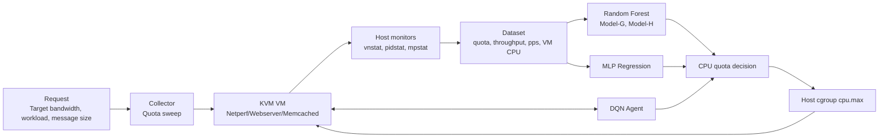

# TASADOR VM CPU Quota Experiments

This repository summarizes experiments for translating network bandwidth SLOs into VM CPU quota allocations. The experiments compare three approaches:

- Random Forest based TASADOR-style CPU translation
- PyTorch MLP regression
- DQN based reinforcement learning

The goal is to understand how each model learns the relationship between network throughput and CPU quota, and how the predicted or selected quota is applied to a KVM VM through host-side cgroup control.

> Security note: all hostnames, IP addresses, usernames, passwords, private paths, and cgroup paths are intentionally omitted. Use `configs/.env.example` as a template for local reproduction.

## Repository Layout

```text
.
├── README.md
├── docs/
│   ├── 01-system-overview.md
│   ├── 02-random-forest-tasador.md
│   ├── 03-mlp-regression.md
│   ├── 04-rl-dqn.md
│   ├── 05-few-shot-tasador.md
│   └── 06-reproduction-notes.md
├── src/
│   ├── random_forest_tasador/
│   ├── mlp_regression/
│   ├── rl_dqn/
│   └── few_shot_tasador/
├── configs/
│   └── .env.example
├── scripts/
│   ├── collect/
│   │   ├── collect_quota_sweep.sh
│   │   └── apply_cpu_quota.sh
│   ├── train/
│   │   ├── train_random_forest.py
│   │   └── train_mlp.py
│   └── evaluate/
│       └── evaluate_predicted_quota.sh
└── .gitignore
```

## `src/` vs `scripts/`

This repository includes both the original script structure and cleaned reproduction templates.

- `src/` contains sanitized copies of the experiment scripts, excluding datasets, checkpoints, raw logs, virtual environments, and generated results.
- `scripts/` contains cleaner templates/wrappers for future reproduction.

If you want to show what was actually done, point readers to [src/README.md](src/README.md). If you want to rerun a simplified version, start from `scripts/`.

## High-Level Workflow



## Dataset Schema

Most experiments use the following CSV schema:

```csv
cpu_quota,message_size,network_throughput,packet_per_sec,vm_cpu_usage
```

The few-shot TASADOR experiments use an extended schema:

```csv
workload,vcpu,cpu_model,mem_gb,nic_gbps,switch_gbps,cpu_quota,message_size,network_throughput,packet_per_sec,vm_cpu_usage
```

## What Each Model Learns

| Approach | Learning Type | Input | Output | VM Connection |
|---|---|---|---|---|
| Random Forest TASADOR | Offline supervised regression | bandwidth SLO, message size, PPS, VM CPU usage | Guest CPU usage and Host CPU quota | predicted quota is applied to host cgroup |
| MLP Regression | Offline supervised regression | message size, throughput, PPS, VM CPU usage | CPU quota | predicted quota is applied by an evaluation script |
| DQN | Online reinforcement learning | quota, message size, throughput, PPS, VM CPU usage | quota adjustment action | each step updates cgroup and observes new metrics |
| Few-shot TASADOR | Offline meta/few-shot regression | support quota samples + query config | query CPU quota | no direct VM control during training |

## Quick Start For Documentation Use

1. Read [docs/01-system-overview.md](docs/01-system-overview.md) for the system architecture.
2. Read model-specific notes:
   - [Random Forest TASADOR](docs/02-random-forest-tasador.md)
   - [MLP Regression](docs/03-mlp-regression.md)
   - [RL DQN](docs/04-rl-dqn.md)
   - [Few-shot TASADOR](docs/05-few-shot-tasador.md)
3. Copy `configs/.env.example` to `.env` only on a private machine.
4. Fill `.env` with local VM and host settings.
5. Use scripts under `scripts/` as sanitized templates, not as direct drop-in production code.

## Important Reproduction Notes

- Do not commit `.env`, raw logs, model checkpoints, or datasets containing private infrastructure details.
- Prefer SSH keys over passwords.
- Avoid password-based SSH helpers in public code. If password-based SSH was used during experiments, describe it only as a local setup detail.
- cgroup paths differ across Linux/libvirt versions. Always set them through environment variables.
- Preserve raw experiment results separately from cleaned public examples.

## Source Experiment Categories

The original experiment server had the following logical categories:

```text
DL experiments
RL experiments
Random Forest TASADOR scripts
Few-shot TASADOR experiments
Collected TASADOR datasets
```

These categories are documented only as provenance. Private server paths are intentionally omitted.
