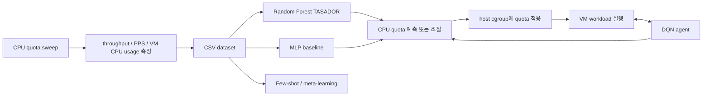

# 한국어 실험 설명

이 저장소는 VM의 network bandwidth SLO를 만족시키기 위해 필요한 CPU quota를 예측하거나 조절하는 실험을 정리한 것이다. 기본 질문은 다음과 같다.

```text
목표 network throughput을 만족하려면
VM 또는 vhost에 CPU quota를 얼마나 할당해야 하는가?
```

이를 위해 Random Forest 기반 TASADOR 방식, PyTorch MLP, DQN 강화학습, few-shot/meta-learning 확장 실험을 비교했다.

## 전체 흐름



## 1. Quota Sweep 데이터 수집

### 의미

가장 기본이 되는 데이터 수집 실험이다. CPU quota를 여러 값으로 바꾸면서 VM에서 workload를 실행하고, 그때의 network throughput과 CPU usage를 측정한다.

### 수집하는 값

이 형식은 임의로 만든 것이 아니라, 실제 실험 CSV 파일과 코드의 `pandas.read_csv(...)` 컬럼 이름에서 가져온 것이다. 일부 오래된 스크립트는 `CPU Quota`, `Message Size`, `Network Throughput`, `PPS`, `VM CPU Usage`처럼 대문자/공백이 있는 이름을 사용하고, 정리 문서에서는 같은 의미를 lowercase snake_case로 통일했다.

```text
cpu_quota
message_size
network_throughput
packet_per_sec
vm_cpu_usage
```

Excel 파일은 주로 RMSE, training time, episode reward 같은 결과 요약을 저장하는 데 사용되었고, RF/MLP/few-shot의 주 학습 입력은 CSV였다. 자세한 내용은 [08-data-format.md](08-data-format.md)에 정리했다.

### 실행 목적

이 데이터는 이후 Random Forest, MLP, few-shot 실험의 학습 데이터로 사용된다.

### 관련 코드

```text
src/random_forest_tasador/test/
src/random_forest_tasador/share/
src/random_forest_tasador/tc/
src/mlp_regression/netperf.py
scripts/collect/collect_quota_sweep.sh
```

## 2. Random Forest TASADOR

### 의미

TASADOR 논문 방식에 가장 가까운 실험이다. network bandwidth SLO를 CPU quota로 번역하는 offline supervised regression 실험이다.

### 모델 구성

TASADOR 방식은 두 모델로 나누어 생각할 수 있다.

```text
Model-G:
  message_size, target throughput -> VM CPU usage

Model-H:
  message_size, target throughput, PPS, VM CPU usage -> CPU quota
```

Model-G가 먼저 VM CPU usage를 예측하고, Model-H가 그 값을 포함해 Host CPU quota를 예측한다. 이 방식을 concatenated prediction이라고 볼 수 있다.

### 실행하면 하는 일

```bash
python3 src/random_forest_tasador/generate_modelG_any.py
python3 src/random_forest_tasador/generate_modelH_any.py
python3 src/random_forest_tasador/evaluate_modelG_any.py
python3 src/random_forest_tasador/evaluate_modelH_any.py
```

### 실험 목적

Random Forest가 bandwidth-to-CPU 관계의 비선형성을 잘 잡는지 확인한다. TASADOR 논문에서는 Linear Regression, SVR과 비교했을 때 Random Forest가 더 낮은 RMSE/RMSLE를 보여 core model로 선택된다.

## 3. MLP / Deep Learning 실험

### 의미

Random Forest 대신 PyTorch 기반 MLP가 CPU quota를 잘 예측할 수 있는지 확인하는 deep learning baseline 실험이다.

### 입력과 출력

```text
입력:
  message_size
  network_throughput
  packet_per_sec
  vm_cpu_usage

출력:
  cpu_quota
```

### 모델 구조 선정

MLP 구조는 Linear layer와 ReLU block 수를 바꾸어가며 비교했다. 평가 지표는 RMSE였고, 실험 기록상 6개의 Linear layer를 사용한 구조가 가장 낮은 RMSE를 보여 최종 구조로 사용했다.

```text
input_dim -> 64 -> 32 -> 32 -> 16 -> 8 -> 1
```

### Epoch 실험

epoch 수를 바꾸어가며 RMSE와 training time을 비교했다.

```text
200, 400, 600, 800, 1000, 1200 epochs
```

관찰한 내용:

```text
epoch가 증가할수록 RMSE는 대체로 감소
training time은 거의 선형적으로 증가
1200 epoch가 가장 낮은 RMSE를 보여 최종 비교에 사용
```

1-vCPU 환경에서는 throughput이 saturation되면서 같은 throughput에 여러 CPU quota가 대응되는 구간이 생긴다. 그래서 1-vCPU는 8-vCPU보다 quota regression이 더 어렵고, DL 결과의 normalized bandwidth 변동성이 더 커질 수 있다.

### 실행하면 하는 일

```bash
python3 src/mlp_regression/regression_dl.py
python3 src/mlp_regression/predict_cpu_quota.py
python3 src/mlp_regression/predict_netperf.py
```

첫 번째 스크립트는 MLP를 학습하고 RMSE를 계산한다. 두 번째는 target SLO에 대한 CPU quota를 예측한다. 세 번째는 예측된 quota를 실제 VM에 적용하고 throughput을 측정한다.

## 4. RL / DQN 실험

### 의미

Random Forest와 MLP는 수집된 CSV를 기반으로 offline prediction을 한다. 반면 DQN은 VM과 상호작용하면서 CPU quota를 step 단위로 조절하는 online control 실험이다.

### State

```text
cpu_quota
message_size
network_throughput
packet_per_sec
vm_cpu_usage
```

### Action

```text
0 -> quota 유지
1 -> quota -1000
2 -> quota +1000
```

### Reward

target throughput에 가까우면 큰 reward를 주고, 멀면 target과의 차이에 비례해 penalty를 준다.

```text
abs(target - measured) < 20이면 reward = 1000
그 외에는 reward = -0.3 * abs(target - measured)
```

### Episode 실험

한 episode는 최대 30 step으로 구성된다. 각 step마다 DQN이 action을 선택하고, quota가 바뀐 뒤 throughput/PPS/CPU usage를 다시 측정한다.

실험에서 본 값:

```text
episode reward
training time
measured throughput
VM CPU usage
normalized bandwidth
```

1-vCPU와 8-vCPU 환경에서 episode 수를 늘려가며, reward가 개선되는지와 normalized bandwidth가 1.0에 가까워지는지를 확인했다. 실험 기록에서는 300 episode 실험이 사용되었다.

### 실행하면 하는 일

```bash
cd src/rl_dqn

# Terminal 1
bash set_cpu.sh

# Terminal 2
python3 DQN1.py
```

실제 실행 시에는 workload generator와 metric collection이 함께 동작해야 한다. DQN은 초기 CPU quota, target SLO, 측정 timing에 민감하므로 offline TASADOR 방식보다 안정성이 낮을 수 있다.

## 5. Few-shot / Meta-learning 확장 실험

### 의미

이 실험은 Random Forest TASADOR 자체가 아니다. TASADOR-style로 수집된 데이터를 이용해, 새 workload/config에서 적은 수의 support sample만 보고 나머지 quota를 예측할 수 있는지 확인하는 meta-learning 확장 실험이다.

### 핵심 질문

```text
모든 quota를 sweep하지 않고
K개의 측정값만 보고
다른 query point의 CPU quota를 예측할 수 있는가?
```

### 왜 Random Forest와 다른가

Random Forest는 전체 dataset으로 고정된 regression function을 학습한다.

```text
message_size, throughput, PPS, VM CPU usage -> CPU quota
```

Few-shot은 support set 자체가 입력의 일부가 된다.

```text
support samples + query config -> query CPU quota
```

따라서 standard Random Forest보다는 SNAIL, RNN/GRU처럼 support sample들의 context를 읽는 모델이 더 자연스럽다.

### 관련 모델

```text
SnailFewShot
RNNFewShot
Sizeless baseline
```

### 실행하면 하는 일

```bash
cd src/few_shot_tasador

python3 train.py --dataset=tasador --rnn --num_shots=5 ...
python3 test.py --dataset=tasador --rnn --num_shots=5 ...
```

또는 batch 실험:

```bash
bash reproduce.sh
bash test.sh
```

## 6. tc / vCPU-share baseline

### 의미

TASADOR와 비교하기 위한 기존 방식 baseline이다.

```text
tc:
  Linux traffic control로 bandwidth 제한

vCPU share:
  VM의 CPU scheduling priority를 조절
```

### 실행하면 하는 일

```bash
cd src/random_forest_tasador/tc
bash run.sh

cd src/random_forest_tasador/share
bash run.sh
```

이 실험은 TASADOR가 기존 network scheduling 또는 CPU-priority 방식보다 target bandwidth를 더 정확하게 만족시키고 CPU 낭비를 줄일 수 있는지 비교하기 위한 것이다.

## 전체 실험 요약

```text
Quota sweep:
  quota 변화에 따른 throughput/CPU usage 데이터 수집

Random Forest TASADOR:
  TASADOR 논문 방식의 bandwidth-to-CPU translation

MLP / DL:
  deep learning regression baseline

RL / DQN:
  online quota control agent

Few-shot / Meta-learning:
  적은 support measurement만으로 quota curve를 예측할 수 있는지 확인

tc / vCPU-share:
  기존 방식 baseline 비교
```
