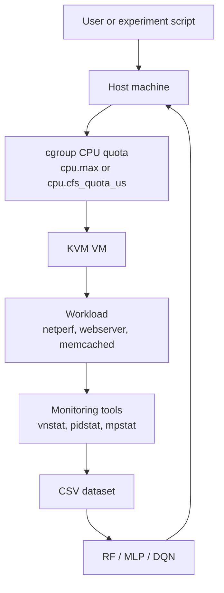

# System Overview

The experiments study how to translate a network bandwidth SLO into the CPU quota required by a VM. The target workload runs in a KVM VM, while measurement and quota enforcement are performed from the host.

## Components



## Measurement Loop

1. Select a CPU quota.
2. Apply the quota to the host-side cgroup that throttles the VM or its vhost/emulator process.
3. Run the workload inside the VM.
4. Measure throughput and CPU usage from the host.
5. Save one row:

```csv
cpu_quota,message_size,network_throughput,packet_per_sec,vm_cpu_usage
```

This row format comes from the measurement CSV files consumed by the Random Forest and MLP scripts. Some older scripts use names such as `CPU Quota`, `Message Size`, `Network Throughput`, `PPS`, and `VM CPU Usage`; the cleaned documentation uses the equivalent lowercase snake_case names. See [08-data-format.md](08-data-format.md).

## Why Host-Side Control

The goal is to avoid modifying applications or guest OS internals. Instead, the host controls how much CPU time the VM-related process can consume. This matches TASADOR's design goal: meeting network bandwidth requirements through VM-level CPU allocation.

## Metrics

- `cpu_quota`: host-side CPU budget applied to the VM/vhost path.
- `message_size`: workload packet/message size.
- `network_throughput`: measured network throughput, usually Mbps.
- `packet_per_sec`: packet rate measured or derived from throughput.
- `vm_cpu_usage`: CPU usage attributed to the VM, vhost, or target process.

## Public Repository Boundary

Keep public docs focused on the method and schema. Do not publish:

- real server IPs
- VM usernames
- passwords or password-based SSH helper commands
- raw private cgroup paths
- raw logs containing hostnames or user paths
