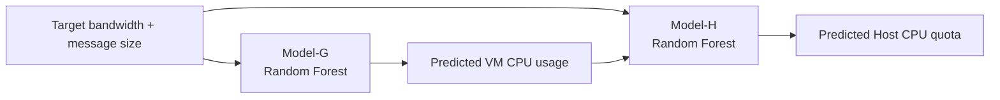

# Random Forest TASADOR

The Random Forest experiments are the closest match to the TASADOR paper design. TASADOR trains two models:

- `Model-G`: predicts Guest/VM CPU usage.
- `Model-H`: predicts Host CPU quota.

## Model-G

Model-G learns how much CPU the VM is expected to use for a target network throughput and message size.

```text
Input:
  message_size
  target_network_throughput

Target:
  vm_cpu_usage
```

In the original scripts, this appeared as:

```python
y = dataset["VM CPU Usage"]
X = dataset.drop(["CPU Quota", "PPS", "VM CPU Usage"], axis=1)
```

## Model-H

Model-H predicts the host-side CPU quota needed to satisfy the target throughput.

```text
Input:
  message_size
  target_network_throughput
  packet_per_sec
  predicted_or_measured_vm_cpu_usage

Target:
  cpu_quota
```

In the original scripts, this appeared as:

```python
y = dataset["CPU Quota"]
X = dataset.drop(["CPU Quota"], axis=1)
```

## Concatenated Prediction

The TASADOR paper uses concatenated CPU prediction:



This makes Model-H aware of the predicted Guest CPU behavior and improves Host quota prediction compared with fully independent models.

## Training Details

The original experiments used:

- `RandomForestRegressor`
- `MinMaxScaler`
- `RandomizedSearchCV` or `GridSearchCV`
- 3-fold or 5-fold cross validation
- RMSE/RMSLE for evaluation
- `joblib` for saving models

## Which Files To Run

The Random Forest TASADOR source tree contains both the main Model-G/Model-H scripts and supporting scripts for data collection or baseline comparison.

### Main Model Training

Run these scripts when the quota-sweep CSV already exists and the goal is to train the TASADOR-style Random Forest models.

| File | Purpose | Input | Output |
|---|---|---|---|
| `src/random_forest_tasador/generate_modelG_any.py` | Train Model-G | quota-sweep CSV with `CPU Quota`, `Message Size`, `Network Throughput`, `PPS`, `VM CPU Usage` | saved `m1_*` model and training-time printout |
| `src/random_forest_tasador/generate_modelH_any.py` | Train Model-H | same quota-sweep CSV | saved `m2_*` model and training-time printout |
| `src/random_forest_tasador/run_model.sh` | Convenience wrapper for Model-G and Model-H training | same CSV files expected by the Python scripts | `modelG.txt`, `modelH.txt`, `G_time.txt`, `H_time.txt` |

Original flow:

```bash
cd src/random_forest_tasador
python3 generate_modelG_any.py
python3 generate_modelH_any.py
```

or:

```bash
cd src/random_forest_tasador
bash run_model.sh
```

What happens internally:

```text
generate_modelG_any.py:
  X = [Message Size, Network Throughput]
  y = VM CPU Usage
  train RandomForestRegressor with RandomizedSearchCV
  save model as m1_*

generate_modelH_any.py:
  X = [Message Size, Network Throughput, PPS, VM CPU Usage]
  y = CPU Quota
  train RandomForestRegressor with RandomizedSearchCV
  save model as m2_*
```

### Model Evaluation

Run these scripts after the `m1_*` and `m2_*` models have been trained.

| File | Purpose | What It Reports |
|---|---|---|
| `src/random_forest_tasador/evaluate_modelG_any.py` | Load Model-G and compare predicted VM CPU usage with measured VM CPU usage | RMSLE/RMSE and prediction table |
| `src/random_forest_tasador/evaluate_modelH_any.py` | Load Model-H and compare predicted CPU quota with measured CPU quota | RMSLE/RMSE and prediction table |
| `src/random_forest_tasador/b.py` | Small single-input inference example for CPU quota prediction | predicted CPU quota for a fixed target throughput/message size |

Example flow:

```bash
cd src/random_forest_tasador
python3 evaluate_modelG_any.py
python3 evaluate_modelH_any.py
```

### Data Collection Helpers

These scripts are used before training, when creating the measurement CSVs.

| File | Purpose |
|---|---|
| `src/random_forest_tasador/test/collect.sh` | Sweep message sizes and CPU quotas, run VM workload, collect `vnstat`/`pidstat` logs |
| `src/random_forest_tasador/test/run.sh` | Run one quota-specific measurement sequence |
| `src/random_forest_tasador/test/set_quota.sh` | Apply a CPU quota to the configured cgroup path |
| `src/random_forest_tasador/test/netperf.py` | Apply predicted/test quotas and run netperf-based evaluation |
| `src/random_forest_tasador/vnstat.sh` | Helper for collecting network throughput/PPS from an interface |

These scripts produce raw logs first. Those logs are then cleaned or converted into CSV rows such as:

```csv
cpu_quota,message_size,network_throughput,packet_per_sec,vm_cpu_usage
```

### Baseline Comparison Helpers

These scripts are not Model-G/Model-H training scripts. They are baseline experiments for comparison with TASADOR.

| File | Purpose |
|---|---|
| `src/random_forest_tasador/tc/run.sh` | Run traffic-control baseline over selected message sizes and bandwidth targets |
| `src/random_forest_tasador/tc/default.sh` | Apply network rate limiting and collect throughput/CPU metrics |
| `src/random_forest_tasador/share/run.sh` | Run vCPU-share/priority baseline over selected settings |
| `src/random_forest_tasador/share/default.sh` | Apply CPU weight/share setting and collect throughput/CPU metrics |

These baselines answer a different question:

```text
How well do network scheduling or vCPU priority mechanisms meet bandwidth targets
compared with TASADOR's predicted CPU quota?
```

## Recommended Public Reproduction Flow

The original scripts contain hardcoded filenames and assume local experiment folders. For a cleaner reproduction, use the sanitized template:

```bash
python3 scripts/train/train_random_forest.py \
  --csv data/quota_sweep.csv \
  --model G \
  --out models/model_g.joblib

python3 scripts/train/train_random_forest.py \
  --csv data/quota_sweep.csv \
  --model H \
  --out models/model_h.joblib
```

The template preserves the model meaning but avoids private paths and stores the scaler/model together in a more reproducible format.

Recommended cleanup for public code:

- Save scaler and model together using `sklearn.pipeline.Pipeline`.
- Replace hardcoded CSV paths with CLI arguments.
- Replace hardcoded output paths with `--model-out`.
- Keep raw private datasets out of the repository.

## Public Template

See [scripts/train/train_random_forest.py](../scripts/train/train_random_forest.py).
