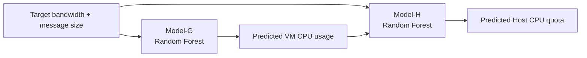

# Random Forest TASADOR

The Random Forest experiments are the closest match to the TASADOR paper design. TASADOR trains two models:

- `Model-G`: predicts Guest/VM CPU usage.
- `Model-H`: predicts Host CPU quota.

## Model-G

Model-G learns how much CPU the VM is expected to use for a target network throughput and message size.

```text
Input:
  message_size
  target_network_throughput

Target:
  vm_cpu_usage
```

In the original scripts, this appeared as:

```python
y = dataset["VM CPU Usage"]
X = dataset.drop(["CPU Quota", "PPS", "VM CPU Usage"], axis=1)
```

## Model-H

Model-H predicts the host-side CPU quota needed to satisfy the target throughput.

```text
Input:
  message_size
  target_network_throughput
  packet_per_sec
  predicted_or_measured_vm_cpu_usage

Target:
  cpu_quota
```

In the original scripts, this appeared as:

```python
y = dataset["CPU Quota"]
X = dataset.drop(["CPU Quota"], axis=1)
```

## Concatenated Prediction

The TASADOR paper uses concatenated CPU prediction:



This makes Model-H aware of the predicted Guest CPU behavior and improves Host quota prediction compared with fully independent models.

## Training Details

The original experiments used:

- `RandomForestRegressor`
- `MinMaxScaler`
- `RandomizedSearchCV` or `GridSearchCV`
- 3-fold or 5-fold cross validation
- RMSE/RMSLE for evaluation
- `joblib` for saving models

Recommended cleanup for public code:

- Save scaler and model together using `sklearn.pipeline.Pipeline`.
- Replace hardcoded CSV paths with CLI arguments.
- Replace hardcoded output paths with `--model-out`.
- Keep raw private datasets out of the repository.

## Public Template

See [scripts/train/train_random_forest.py](../scripts/train/train_random_forest.py).

