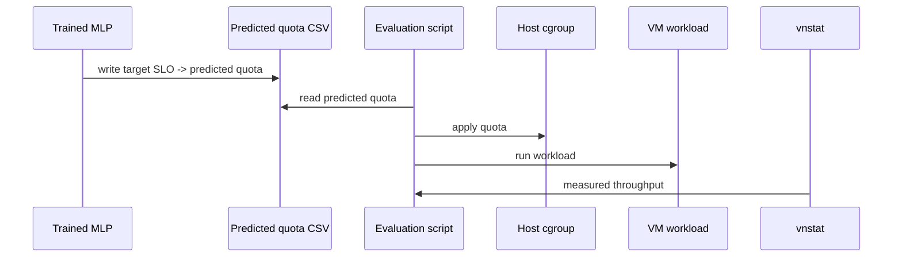

# MLP Regression

The MLP experiments use PyTorch to train a supervised regression model that predicts CPU quota from observed network and CPU metrics.

## Input And Target

```text
Input:
  message_size
  network_throughput
  packet_per_sec
  vm_cpu_usage

Target:
  cpu_quota
```

## Model

The original implementation used six linear layers with ReLU activations:

```text
input_dim -> 64 -> 32 -> 32 -> 16 -> 8 -> 1
```

## Training Setup

- Loss: mean squared error
- Optimizer: Adam
- Metric: RMSE
- Epochs: experiments compared values up to around 1200
- Train/test split: 70/30 or 80/20 depending on the script

## VM Evaluation Loop

The MLP itself is offline. VM interaction happens after prediction:



## Observed Behavior

The MLP can learn nonlinear relationships, but the mapping from throughput to quota can become ambiguous. For example, a single throughput value may appear under multiple CPU quota settings due to saturation or VM/network behavior. This makes quota prediction less stable than TASADOR's Random Forest approach in some settings.

## Public Template

See [scripts/train/train_mlp.py](../scripts/train/train_mlp.py).

