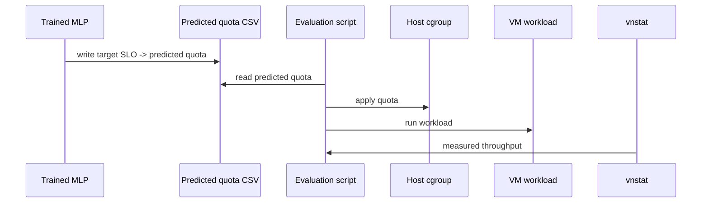

# MLP Regression

The MLP experiments use PyTorch to train a supervised regression model that predicts CPU quota from observed network and CPU metrics.

## Input And Target

```text
Input:
  message_size
  network_throughput
  packet_per_sec
  vm_cpu_usage

Target:
  cpu_quota
```

## Model

The original implementation used six linear layers with ReLU activations:

```text
input_dim -> 64 -> 32 -> 32 -> 16 -> 8 -> 1
```

## Model Selection

The MLP was not intended to be a new TASADOR architecture. It was used as a deep learning baseline to check whether a simple neural regressor can learn the same bandwidth-to-CPU relationship that TASADOR models with Random Forest.

The model structure was selected by comparing different numbers of linear layers. The experiment used RMSE as the main selection metric. The six-linear-layer model showed the lowest RMSE among the tested structures, so it was used for the main DL comparison.

```text
Candidate idea:
  vary number of Linear + ReLU blocks

Selection metric:
  RMSE between predicted CPU quota and measured CPU quota

Selected structure:
  6 Linear layers with ReLU between hidden layers
```

The chosen architecture is still intentionally small. The purpose was not to build a very large neural model, but to compare a practical MLP baseline against TASADOR's Random Forest model under the same quota/throughput data.

## Training Setup

- Loss: mean squared error
- Optimizer: Adam
- Metric: RMSE
- Epochs: experiments compared values up to around 1200
- Train/test split: 70/30 or 80/20 depending on the script

## Epoch Sweep

The DL experiments were run while varying the number of training epochs. The goal was to observe:

- whether RMSE decreases as training continues
- how much additional training time is required
- whether the final predicted quota improves actual normalized bandwidth after being applied to the VM

The experiment notes compare checkpoints such as 200, 400, 600, 800, 1000, and 1200 epochs. In the observed results, RMSE generally decreased as epochs increased, while training time increased approximately linearly.

Example interpretation from the experiment notes:

```text
1-vCPU:
  RMSE decreased from about 17705 at 200 epochs
  to about 16403 at 1200 epochs

8-vCPU:
  RMSE decreased from about 11154 at 200 epochs
  to about 9580 at 1200 epochs
```

The 1200-epoch result was therefore used as the strongest DL setting for model-performance comparison.

## 1-vCPU vs 8-vCPU Behavior

The 1-vCPU case was harder for the MLP than the 8-vCPU case. The reason is that the network throughput curve can become ambiguous under CPU saturation. For example, in the 1-vCPU setting, increasing CPU quota does not always monotonically increase throughput. Similar throughput values can appear at multiple quota values, which makes direct quota regression difficult.

This ambiguity explains why 1-vCPU RMSE remained higher than 8-vCPU RMSE and why the DL normalized bandwidth distribution was less stable than TASADOR's Random Forest predictions.

## VM Evaluation Loop

The MLP itself is offline. VM interaction happens after prediction:



## Observed Behavior

The MLP can learn nonlinear relationships, but the mapping from throughput to quota can become ambiguous. For example, a single throughput value may appear under multiple CPU quota settings due to saturation or VM/network behavior. This makes quota prediction less stable than TASADOR's Random Forest approach in some settings.

## Public Template

See [scripts/train/train_mlp.py](../scripts/train/train_mlp.py).
