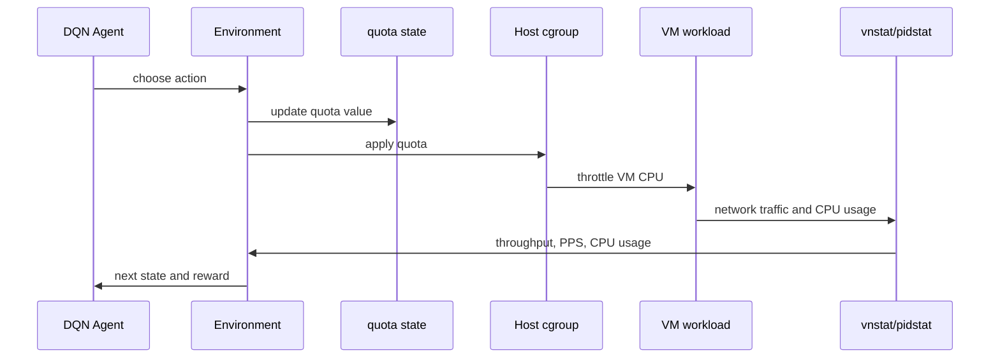

# Reinforcement Learning: DQN

The RL experiment uses DQN to adjust CPU quota online. Unlike Random Forest and MLP, DQN interacts with the VM repeatedly during training.

## State

The DQN state has five values:

```text
[
  cpu_quota,
  message_size,
  network_throughput,
  packet_per_sec,
  vm_cpu_usage
]
```

## Action

The action space has three actions:

```text
0 -> keep quota
1 -> decrease quota by 1000
2 -> increase quota by 1000
```

The quota is clamped to:

```text
1000 <= cpu_quota <= 100000
```

## Reward

The reward encourages throughput close to the network SLO:

```text
if abs(target_throughput - measured_throughput) < 20:
    reward = 1000
else:
    reward = -0.3 * abs(target_throughput - measured_throughput)
```

## DQN Network

```text
5 -> 128 -> 64 -> 32 -> 3
```

The network outputs one Q-value for each quota adjustment action. The selected action is the one with the highest Q-value, except during epsilon-greedy exploration.

## Training Parameters

```text
batch_size = 128
gamma = 0.99
replay_memory = 10000
epsilon_start = 0.9
epsilon_end = 0.05
epsilon_decay = 500
target_update_tau = 0.005
steps_per_episode = 30
```

## Episode Design

Each episode starts from an initial CPU quota and repeatedly adjusts quota for a fixed number of steps. In the original code, each episode has 30 steps. At each step:

1. the agent observes the current state
2. the DQN chooses one of three quota actions
3. the environment writes the new quota
4. the host applies that quota through cgroup
5. throughput/PPS/CPU usage are measured again
6. the reward is computed from the distance to the network SLO

```text
one episode = up to 30 quota-control steps
episode reward = sum of step rewards
```

The experiments were run over many episodes to see whether the agent gradually learns a quota adjustment policy. The experiment notes describe 300-episode runs for 1-vCPU and 8-vCPU settings. The code also has a CPU-only fallback that can run fewer episodes depending on the runtime environment.

## Episode-Level Evaluation

The main quantities tracked by episode were:

- average or total reward
- training time
- final or observed network throughput
- VM CPU usage
- normalized bandwidth

The reward curve was used to judge whether the agent was finding quota values close to the target SLO. Large negative rewards mean the agent usually failed to reach the target within the allowed steps.

## Initial Condition Sensitivity

The RL experiment was sensitive to the initial CPU quota and target network SLO.

In one setting, the experiments started from a high initial quota such as 100000 and used middle-range network SLOs. The average reward stayed strongly negative, meaning the agent did not consistently discover a quota that reached the target bandwidth.

In another setting, the initial CPU quota and network SLO were adjusted more carefully. Under those conditions, normalized bandwidth came much closer to 1.0, showing that DQN can work for some initial conditions but was not as stable as the offline TASADOR/MLP flow.

This is the key interpretation:

```text
Random Forest / MLP:
  learn from collected CSV data, then predict quota offline

DQN:
  learns through online interaction, so timing, initial quota,
  reward scale, and measurement noise strongly affect results
```

## Online Control Loop



## Reproduction Caveat

The original code assumes external processes are already running:

- a workload generator such as netperf
- a quota application loop
- metric collection scripts

For a clean public reproduction, integrate these steps into a single environment class and pass all host/VM settings through environment variables.
