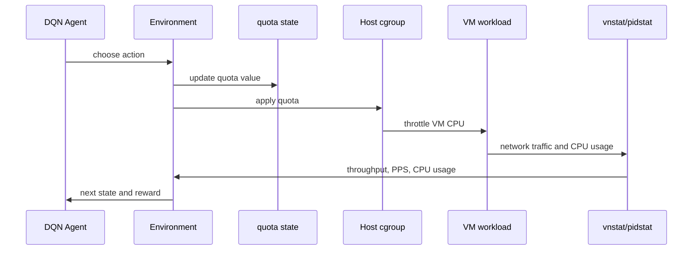

# Reinforcement Learning: DQN

The RL experiment uses DQN to adjust CPU quota online. Unlike Random Forest and MLP, DQN interacts with the VM repeatedly during training.

## State

The DQN state has five values:

```text
[
  cpu_quota,
  message_size,
  network_throughput,
  packet_per_sec,
  vm_cpu_usage
]
```

## Action

The action space has three actions:

```text
0 -> keep quota
1 -> decrease quota by 1000
2 -> increase quota by 1000
```

The quota is clamped to:

```text
1000 <= cpu_quota <= 100000
```

## Reward

The reward encourages throughput close to the network SLO:

```text
if abs(target_throughput - measured_throughput) < 20:
    reward = 1000
else:
    reward = -0.3 * abs(target_throughput - measured_throughput)
```

## DQN Network

```text
5 -> 128 -> 64 -> 32 -> 3
```

## Training Parameters

```text
batch_size = 128
gamma = 0.99
replay_memory = 10000
epsilon_start = 0.9
epsilon_end = 0.05
epsilon_decay = 500
target_update_tau = 0.005
steps_per_episode = 30
```

## Online Control Loop



## Reproduction Caveat

The original code assumes external processes are already running:

- a workload generator such as netperf
- a quota application loop
- metric collection scripts

For a clean public reproduction, integrate these steps into a single environment class and pass all host/VM settings through environment variables.

