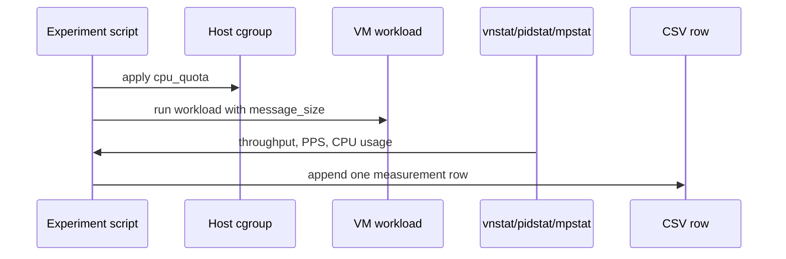

# Data Format

This page explains where the dataset schema came from and how CSV/Excel files were used in the experiments.

## Short Answer

The core training format came from CSV files and the Python scripts that loaded them with `pandas.read_csv`.

Excel files were mainly used for result summaries such as RMSE, training time, and episode rewards. They were not the primary training data format for the Random Forest/MLP/few-shot pipelines.

## Main CSV Schema

Most Random Forest and MLP scripts use a five-column measurement format:

```csv
cpu_quota,message_size,network_throughput,packet_per_sec,vm_cpu_usage
```

Some older Random Forest scripts load headerless CSV files and manually assign column names:

```python
pd.read_csv(
    "m2_train_8vcpu_5000_config1_webserver.csv",
    names=[
        "CPU Quota",
        "Message Size",
        "Network Throughput",
        "PPS",
        "VM CPU Usage",
    ],
)
```

Newer or cleaned DL scripts use lowercase snake_case headers directly:

```csv
cpu_quota,message_size,network_throughput,packet_per_sec,vm_cpu_usage
1000,1480,6.77,600,16.7
1000,1480,6.94,615,17.0
```

These two formats represent the same information:

| Clean column name | Older script name | Meaning |
|---|---|---|
| `cpu_quota` | `CPU Quota` or `thread_quota` | CPU quota applied to the VM/vhost path |
| `message_size` | `Message Size` or `packet_size` | workload message size |
| `network_throughput` | `Network Throughput` or `bandwidth_tx` | measured network throughput |
| `packet_per_sec` | `PPS` or `pps_tx` | packet rate |
| `vm_cpu_usage` | `VM CPU Usage` or `cpu_usage` | CPU usage attributed to the VM/vhost/workload |

## How Each Row Was Produced

Each row is one measurement under a specific CPU quota and workload condition.



So the schema is not arbitrary. It mirrors what the data collection scripts measured:

- CPU quota set by the host
- workload message size
- network throughput observed after applying the quota
- packet rate observed during the workload
- VM/vhost CPU usage during the workload

## Extended Few-Shot Schema

The few-shot/meta-learning experiment uses an extended CSV because it needs workload and hardware context in addition to quota/throughput measurements:

```csv
workload,vcpu,cpu_model,mem_gb,nic_gbps,switch_gbps,cpu_quota,message_size,network_throughput,packet_per_sec,vm_cpu_usage
```

Example shape:

```csv
workload,vcpu,cpu_model,mem_gb,nic_gbps,switch_gbps,cpu_quota,message_size,network_throughput,packet_per_sec,vm_cpu_usage
netperf,1,<cpu-model>,256,10,10,1000,64,2.51,212,3.4
```

This format lets the few-shot dataset group rows by:

```text
workload
vcpu
cpu_model
mem_gb
nic_gbps
switch_gbps
message_size
```

Within each group, the code sorts rows by `cpu_quota`, selects a few support samples, and predicts the query sample's CPU quota.

## Excel Files

Excel files appear in the experiment folders, but their role is different from the CSV files.

They were used mainly for:

- DL RMSE/training-time summaries
- RL episode reward logs
- evaluation tables
- quick plotting or manual inspection

Examples of values written to Excel:

```text
epoch, RMSE, training_time
episode, reward, time, network_throughput, vm_cpu_usage
test_y, pred_y
```

In other words:

```text
CSV:
  training/evaluation input data

Excel:
  experiment result logs and summaries
```

## Why Data Files Are Not Included

The repository intentionally excludes raw CSV/Excel files because they may contain machine-specific measurements, private paths, or large experimental outputs.

Instead, this repository documents:

- the schema
- how the schema was produced
- which scripts consume it
- sanitized templates for reproducing it

